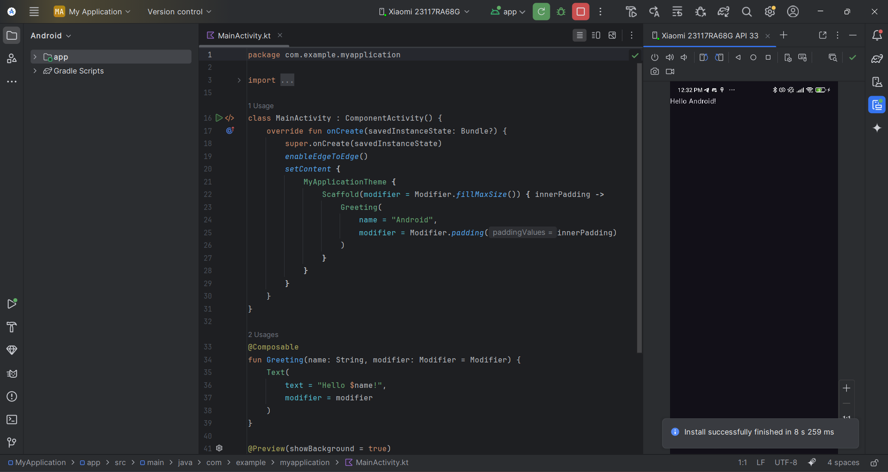
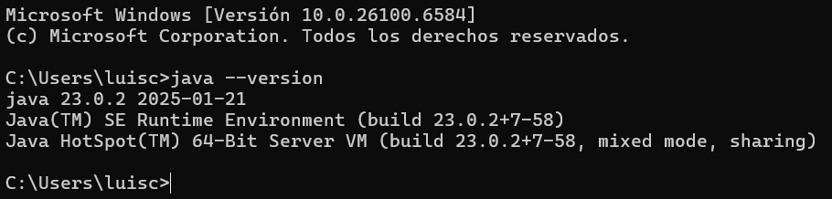
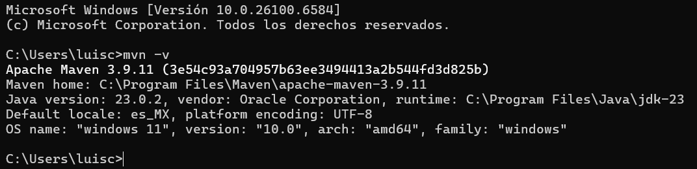
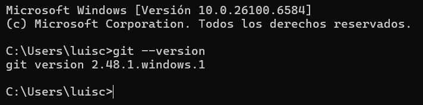
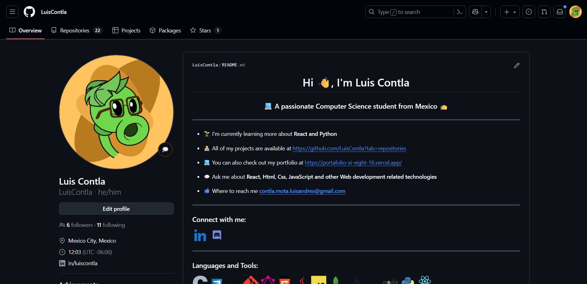
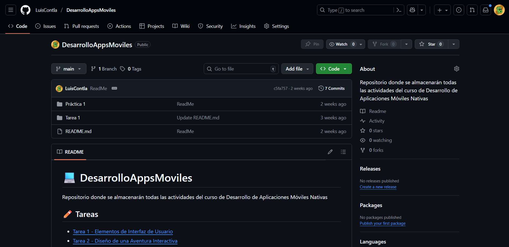
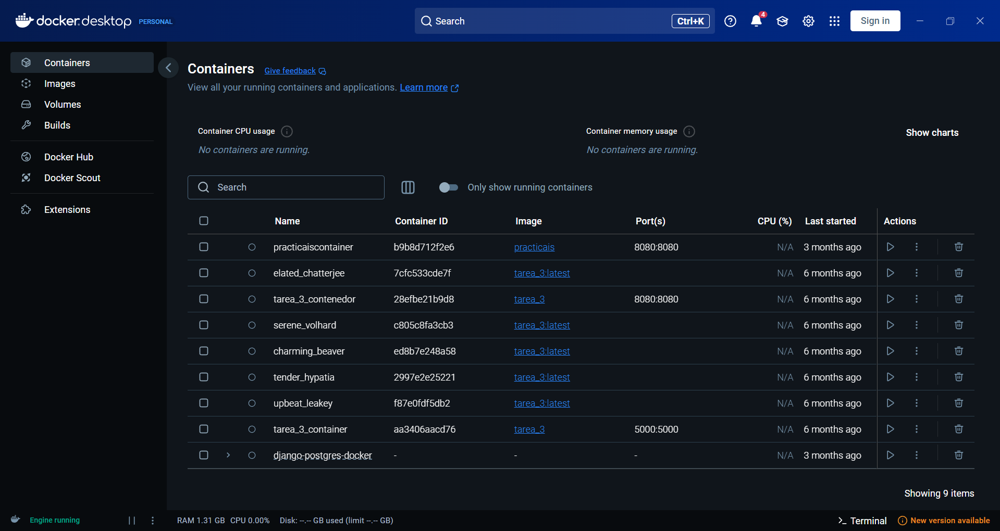
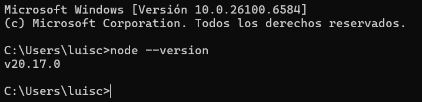

# Ejercicio 1 - Instalación de Herramientas

## 🎯 Objetivo
Instalar y configurar las herramientas esenciales para el desarrollo de aplicaciones móviles con un IDE para desarrollo Android, creando un entorno de trabajo completo y funcional en tu sistema operativo (macOS, Linux o Windows).

---

## 🧰 Herramientas a Instalar

- Andorid Studio
- Java Development Kit (JDK)
- Maven
- Git
- GitHub
- Docker
- Node.js
- Flutter

---

## 📸 Evidencias

- **Android Studio Instalado y Funcionando**  
  
- **Java Development Kit (JDK)**  
    
- **Maven**  
    
- **Git**  
    
- **GitHub**  
  
    
- **Docker**  
      
- **Node.js**  
      
- **Flutter**  
  