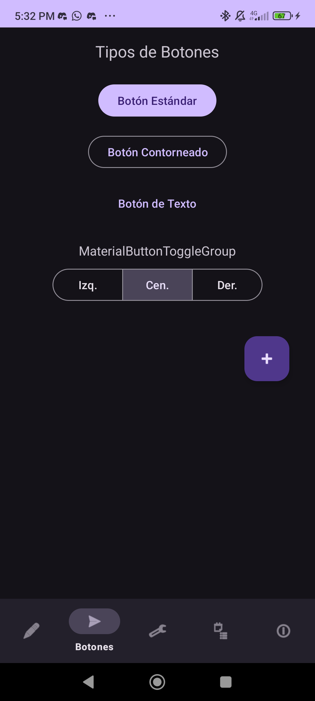
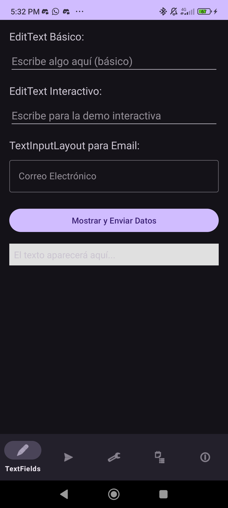

# Ejercicio 2 - Transiciones entre Activities y Fragments

## 🎯 Objetivo
Crear una aplicación Android que demuestre el uso de **Activities y Fragments** para explicar distintos elementos de interfaz de usuario, desarrollando una versión en AndroidStudio (Kotlin) y otra en Flutter.

---

## 🚀 Instalación y Ejecución Kotlin

1. Clonar el repositorio:  
   ```bash
   git clone https://github.com/usuario/mi-aplicacion-android.git
   ```
2. Abrir el proyecto en **Android Studio**.  
3. Ejecutar la aplicación en un **emulador** o **dispositivo físico** con Android 8.0 o superior.  
4. Explorar los diferentes fragments a través de la barra de navegación inferior.  

---

## 🛠️ Notas de Desarrollo Kotlin
- Implementación de la **barra de navegación inferior** en `MainActivity`.  
- Refactorización completa para uso de **ViewBinding**.  
- Creación de un **SharedViewModel** para comunicación entre fragments.  
- Inclusión de un **RecyclerView** con adaptador en `ListsFragment`.  
- Mejora de diseños y adición de recurso **vectorial dibujable**.  
- Actualización de dependencias a bibliotecas **KTX** de ciclo de vida y fragmentos.  
- Limpieza del repositorio eliminando archivos obsoletos (.idea).  

---

## 📸 Capturas de Funcionamiento Kotlin  
- **ButtonsFragment**  
    

- **ListsFragment**  
    

- **InfoElementsFragment**  
    

- **SelectionControlsFragment**  
    

- **TextFieldsFragment**  
    
