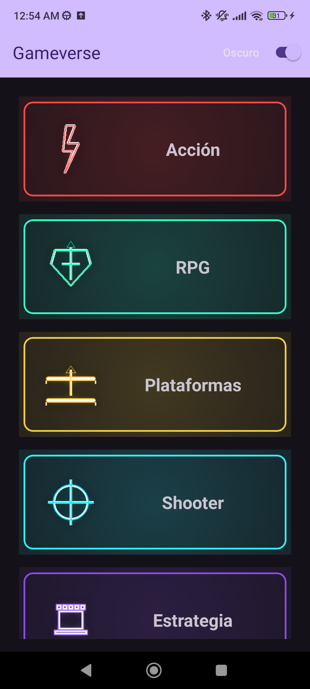
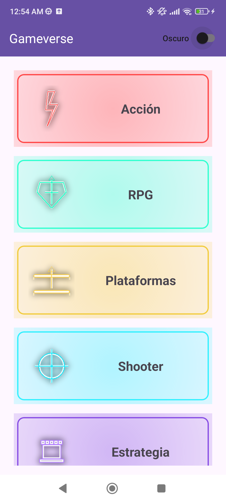
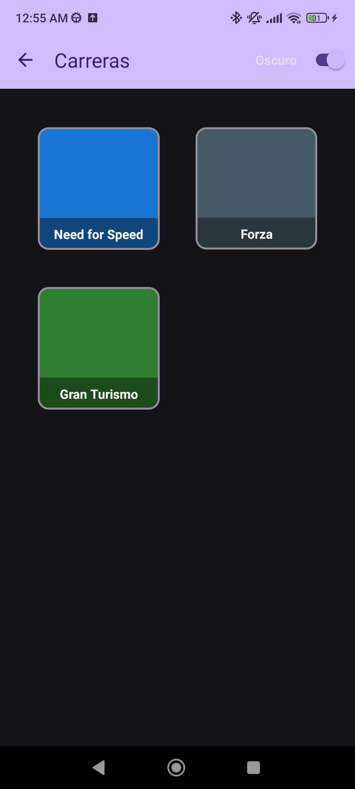
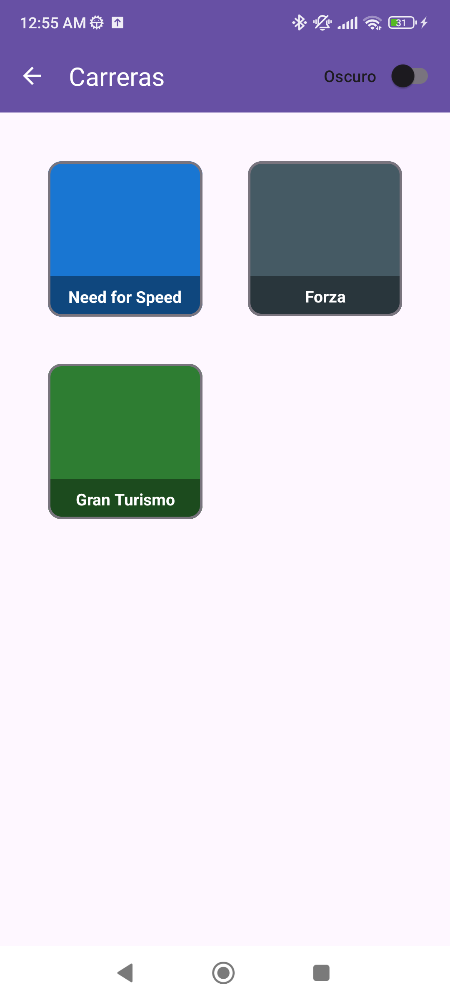
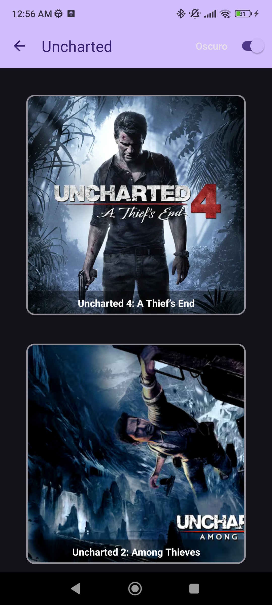
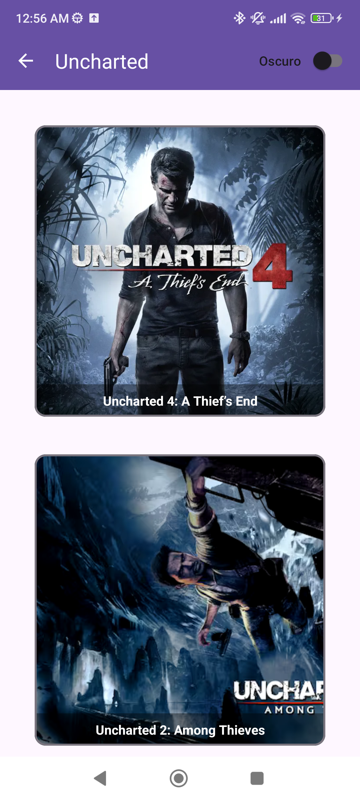
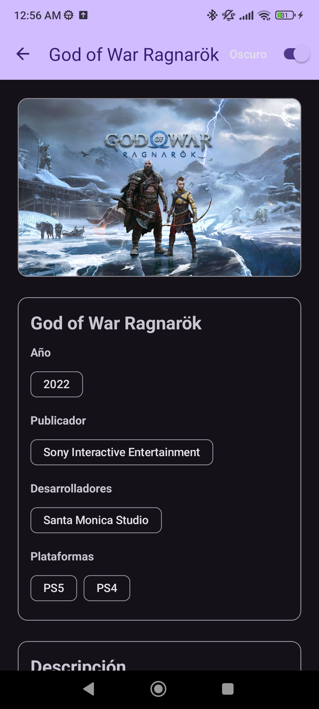
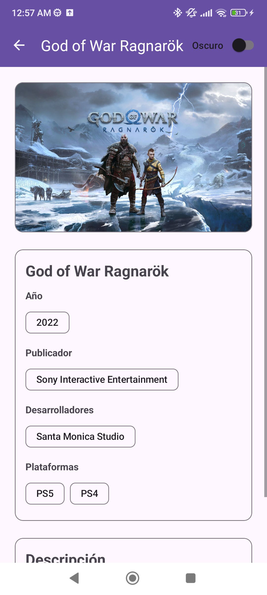

# Práctica 2: Aplicación móvil básica

**GameVerse** — App Android con navegación jerárquica e identidad visual temática de **videojuegos**. Tres niveles (**Géneros → Franquicias → Juegos**) con **Activities** y **Fragments**, listas con **RecyclerView**, **transiciones** Material y **cambio de tema Claro/Oscuro** desde la Toolbar.

> **Asignación**: navegación temática inmersiva con 3 niveles jerárquicos, UI creativa y transiciones no triviales.  
> **Fecha límite**: **jueves 25 de septiembre de 2025**.

---

## 🗺️ Estructura jerárquica

1. **Nivel 1 – Géneros** → `MainActivity` + `GenresFragment`  
   - Lista de géneros en **1 columna** con borde “neón” a partir del color dominante del ícono.

2. **Nivel 2 – Franquicias** → `FranchiseActivity` + `FranchiseFragment`  
   - **Grid** de 2 columnas con las franquicias del género.

3. **Nivel 3 – Juego**  
   - **Lista de juegos por franquicia** → `GamesActivity` + `GamesListFragment` (1 columna).  
   - **Detalle del juego** → `GameActivity` + `GameFragment` (portada, chips de año/publisher/devs/plataformas, descripción con **“Leer más”**, y **facts**).

---

## 🌓 Cambio de tema

- **Switch Claro/Oscuro** en la Toolbar de todas las Activities (sin opción “Sistema”).  
- Gestión centralizada en `util/ThemeManager.kt` con `SharedPreferences`.  
- El tema se **aplica antes** de inflar vistas para evitar “flash” claro:
  ```kotlin
  // En cada Activity
  ThemeManager.applySaved(this)
  ```
- Conmutación en el switch:
  ```kotlin
  switch.isChecked = (ThemeManager.current(this) == ThemeManager.Mode.DARK)
  switch.setOnCheckedChangeListener { _, isDark ->
      ThemeManager.apply(if (isDark) ThemeManager.Mode.DARK else ThemeManager.Mode.LIGHT, this)
      recreate()
  }
  ```

---

## 🛠️ Requisitos técnicos que cumple

- 3 **Activities** jerárquicas con **Fragments**.  
- **Transiciones** Material entre pantallas y **títulos contextuales** en Toolbars.  
- **Cambio de tema** persistente (Claro/Oscuro).  
- **Kotlin + ViewBinding**, **ListAdapter + DiffUtil** para *adapters*.

---

## 🧩 Organización del proyecto

```
app/src/main/java/com/example/gameverse/
├── data/
│   ├── GameRepository.kt
│   └── models/{Genre.kt, Franchise.kt, Game.kt, Poi.kt}
├── ui/
│   ├── main/
│   │   ├── MainActivity.kt
│   │   ├── GenresFragment.kt
│   │   └── GenreAdapter.kt
│   ├── franchise/
│   │   ├── FranchiseActivity.kt
│   │   ├── FranchiseFragment.kt
│   │   └── FranchiseAdapter.kt
│   └── game/
│       ├── GamesActivity.kt
│       ├── GamesListFragment.kt
│       ├── GameActivity.kt
│       └── GameFragment.kt
└── util/
    ├── GridSpacingItemDecoration.kt
    ├── ResExt.kt
    └── Transitions.kt
```

**Layouts**: ver lista en el README 1 +  
`res/menu/menu_theme_switch.xml` y `res/layout/action_theme_switch.xml` (switch en Toolbar).

---

## 🔧 Stack & requisitos

- **Kotlin**, **compileSdk 34**, **minSdk 24**, **targetSdk 34**, **JVM 17**.  
- **ViewBinding** habilitado.  
- Dependencias principales:
  ```kotlin
  implementation("androidx.core:core-ktx:1.13.1")
  implementation("androidx.appcompat:appcompat:1.7.0")
  implementation("com.google.android.material:material:1.12.0")
  implementation("androidx.constraintlayout:constraintlayout:2.1.4")
  implementation("androidx.fragment:fragment-ktx:1.8.3")
  implementation("androidx.recyclerview:recyclerview:1.3.2")
  implementation("androidx.activity:activity-ktx:1.9.2")
  implementation("com.google.android.flexbox:flexbox:3.0.0")
  ```

---

## 🚀 Cómo ejecutar

1. Abrir el proyecto en Android Studio.  
2. Sincronizar Gradle.  
3. Ejecutar en emulador o dispositivo (API 24+).

---

## 🧠 Decisiones de diseño

- Estructura en 3 niveles (Activities) para claridad y para cumplir el requerimiento.  
- Borde “neón” dinámico en géneros para reforzar la temática.  
- Cards de detalle con “Leer más”.  
- **Tema Claro/Oscuro** con persistencia y aplicación temprana.

---

## 🧩 Retos y soluciones

- **Menú con actionView** (switch) que en *preview* se veía pero no en runtime → inflado del menú en `onCreateOptionsMenu` y enlace del switch desde el `actionView`.  
- **Parpadeo de tema** → aplicar el tema guardado **antes** de `setContentView`.

---

## 📸 Capturas

- MainActivity

<p align="center">
  
  
</p>

- FranchiseActivity

<p align="center">
  
  
</p>

- GamesActivity

<p align="center">
  
  
</p>

- GameActivity

<p align="center">
  
  
</p>


