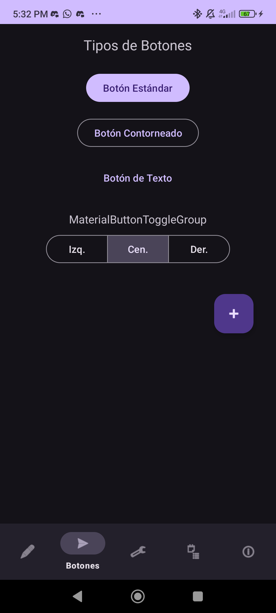
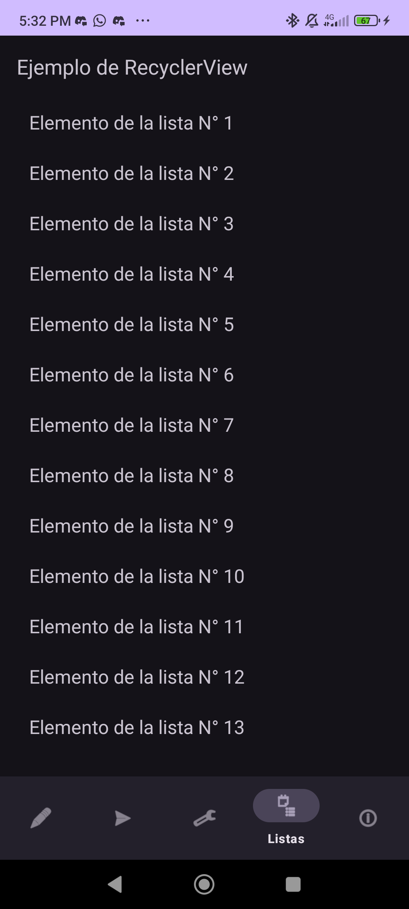
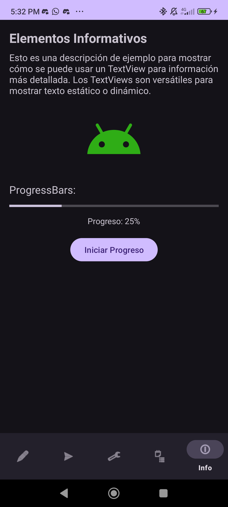
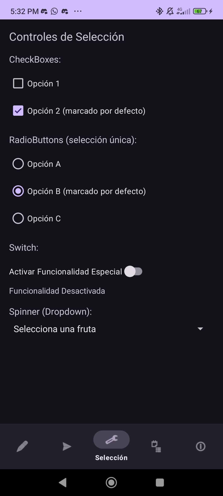
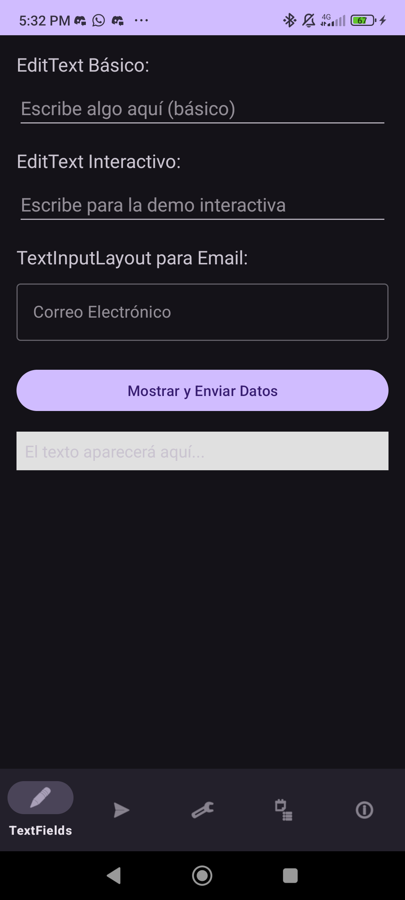

# 📱 Tarea 1 - Elementos de Interfaz de Usuario

## 🎯 Objetivo  
Este proyecto tiene como finalidad demostrar el uso de **Activities** y **Fragments** en Android para ejemplificar y analizar diferentes elementos de la interfaz de usuario.  

La aplicación busca reforzar la comprensión de los principios de diseño modular, la navegación entre componentes y el uso de patrones de interacción comunes en aplicaciones móviles modernas.  

---

## 📋 Características  

### 🔹 Estructura  
- **MainActivity** como actividad principal, que administra la barra de navegación inferior y el flujo entre fragments.  
- **Fragments implementados**:  
  - `ButtonsFragment` → ejemplos de Button, ImageButton y FloatingActionButton.  
  - `InfoElementsFragment` → incluye TextView, ImageView y ProgressBar.  
  - `ListsFragment` → implementación de RecyclerView con adaptador.  
  - `SelectionControlsFragment` → controles de selección como CheckBox, RadioButton y Switch.  
  - `TextFieldsFragment` → demostración de EditText y manejo de entradas de texto.  

### 🔹 Funcionalidades destacadas  
- Uso de **ViewBinding** en todos los fragments para mejorar la seguridad y claridad del código.  
- Inclusión de un **SharedViewModel** (`SharedViewModel.kt`) como mecanismo de comunicación entre fragments.  
- Implementación de un **RecyclerView** funcional en `ListsFragment`.  
- **Diseños limpios y organizados**, con explicaciones breves sobre el propósito de cada componente de UI.  
- **Interactividad completa**, permitiendo al usuario experimentar con cada elemento.  

---

## 🚀 Instalación y Ejecución  

1. Clonar el repositorio:  
   ```bash
   git clone https://github.com/usuario/mi-aplicacion-android.git
   ```
2. Abrir el proyecto en **Android Studio**.  
3. Ejecutar la aplicación en un **emulador** o **dispositivo físico** con Android 8.0 o superior.  
4. Explorar los diferentes fragments a través de la barra de navegación inferior.  

---

## 🛠️ Notas de Desarrollo  
- Implementación de la **barra de navegación inferior** en `MainActivity`.  
- Refactorización completa para uso de **ViewBinding**.  
- Creación de un **SharedViewModel** para comunicación entre fragments.  
- Inclusión de un **RecyclerView** con adaptador en `ListsFragment`.  
- Mejora de diseños y adición de recurso **vectorial dibujable**.  
- Actualización de dependencias a bibliotecas **KTX** de ciclo de vida y fragmentos.  
- Limpieza del repositorio eliminando archivos obsoletos (.idea).  

---

## 📸 Capturas de Funcionamiento  
- **ButtonsFragment**  
    

- **ListsFragment**  
    

- **InfoElementsFragment**  
    

- **SelectionControlsFragment**  
    

- **TextFieldsFragment**  
    
